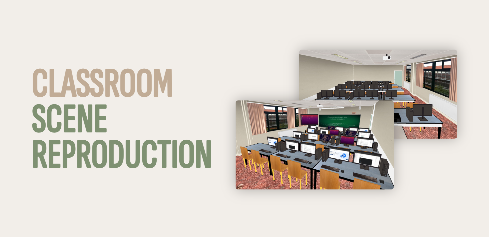

  <h1 align="center">Preview generator</h2>
  
Generate previews for README.md on Github

  
  
  

  
  
  

## About

## Backgrounds

### Plain background

### Gradient backgrounds

## Layouts

### Single picture

(with ou without text)
vertical orientation || horizontal orientation

### Two pictures

(with ou without text)
vertical orientation || horizontal orientation

- With text and horizontal orientation for pictures :

  

### Three pictures