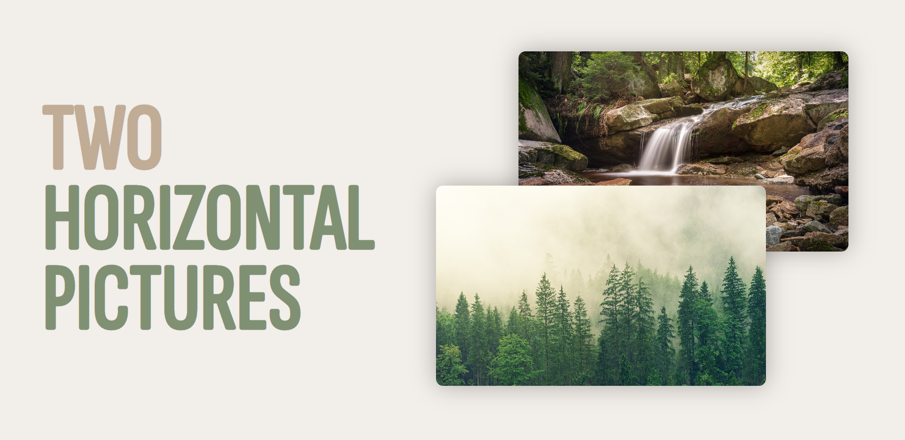

  <h1 align="center">Preview generator</h1>
  <h4 align="center">Generate previews for yours README files on Github</h4>

  
  

  
  
  

## About

## Get started

Choose your favorite layout
Choose your font if the layout uses text, choose the background color or linear colors

> This project is responsive, it has been adapted to laptop and desktop format.

## Backgrounds

### Plain background

### Gradient backgrounds

## Layouts

### Single picture

- **Layout 1**: a single picture, horizontal orientation, without text

  

- **Layout 2**: a single picture, vertical orientation, without text

- **Layout 3**: a single picture, horizontal orientation, text on the left

- **Layout 4**: a single picture, horizontal orientation, text on the right

- **Layout 5**: a single picture, vertical orientation, text on the left

- **Layout 6**: a single picture, vertical orientation, text on the right

### Two pictures

- **Layout 7**: two pictures, horizontal orientation, text on the left:

  

- **Layout 8**: two pictures, horizontal orientation, text on the right:

- **Layout 9**: two pictures, vertical orientation, text on the left:

- **Layout 10**: two pictures, vertical orientation, text on the right:

### Three pictures
